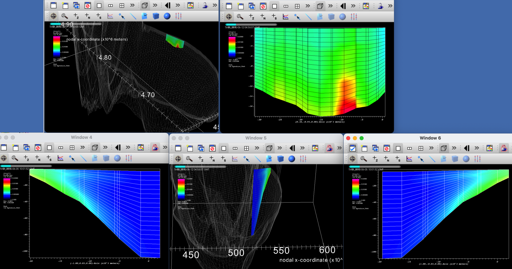

# Interactive visualization of transects - demo

The new script that sets up VisIt for an interactive session is `setup_interactive.py`.  Before running, you need to comment out or modify the following unless you are Lisa.  
```
import sys
sys.path.append("/Users/lisalowe/visit-for-fvcom")
```
From the terminal, run the 'setup_interactive.py' script.  Do not use 'cli' option, and put it in the background with `&`.
```
visit -s setup_interactive.py &
```

Everything is loaded according to the parameters that would have been used in a batch script.  You can use the GUI as usual, or cut/paste different plot into the cli.

Once the GUI opens, a terminal should open, and that is the VisIt CLI.  If not, open the cli from VisIt:  Controls:Launch CLI

All the options will be read in from *setparams.py*, so the first transect will be those points.  Plot the transect against the 3D grid.
```
transect_against_3D(TITLE_TP_EPA,UNITS_TP_EPA,"TP_EPA",MIN_TP,MAX_TP,FROM_X,FROM_Y,TO_X,TO_Y)
```

The script locks the time in view in the first plot, so each new cloned window will inherit the 'locked' propery.  To clone the window, do
```
CloneWindow()
DrawPlots()
```

After cloning a window with the 3D mesh plus transect, to add the 2D next to it, first use the GUI to *delete* the two plots in the second window - Pseduocolor and Mesh.  Then, use the 2D transect function at the command line:
```
create_pseudocolor_2Dtransect(TITLE_TP_EPA,UNITS_TP_EPA,"TP_EPA",MIN_TP,MAX_TP,FROM_X,FROM_Y,TO_X,TO_Y)
```
To change to a dark backgroud (if it is not already dark), do:
```
InvertBackgroundColor()
```
To layer a mesh over the plot, do
```
AddPlot("Mesh", "SigmaLayer_Mesh", 1, 1)
DrawPlots()
```

# Change the points
To create a transect using different points from the GUI without starting over, just redefine the two points and redraw the transect.  Instead of deleting the first two windows, make a third:
```
CloneWindow()
DrawPlots()
```

Delete the existing plots.  Redefine the points:
```
FROM_X = 535724.94 
FROM_Y = 4782202.0 
TO_X = 553283.13 
TO_Y = 4781751.5 
```

For your convienence, here are the same commands!

To make the 3D plot of the whole grid that shows the transect, do:
```
transect_against_3D(TITLE_TP_EPA,UNITS_TP_EPA,"TP_EPA",MIN_TP,MAX_TP,FROM_X,FROM_Y,TO_X,TO_Y)
```

To change to a dark backgroud (if it is not already dark), do:
```
InvertBackgroundColor()
```

The script locks the time in view in the first plot, so each new cloned window will inherit the 'locked' propery.  To clone the window, do
```
CloneWindow()
DrawPlots()
```

After cloning a window with the 3D mesh plus transect, to add the 2D next to it, first use the GUI to delete the two plots in the second window - Pseduocolor and Mesh.  Then, use the 2D transect function at the command line:
```
create_pseudocolor_2Dtransect(TITLE_TP_EPA,UNITS_TP_EPA,"TP_EPA",MIN_TP,MAX_TP,FROM_X,FROM_Y,TO_X,TO_Y)
```
To change to a dark backgroud (if it is not already dark), do:
```
InvertBackgroundColor()
```

# Is it going the 'wrong' way?

Now if you do that, you'll see the transect is going the 'wrong' way!  For the transect to look 'as expected' (or how I expect it), the 'from' point has to have the smaller Y coordinate.

Let's do a 5th and 6th plot:
```
CloneWindow()
DrawPlots()
```

Delete the existing plots.  Redefine the points, swap TO and FROM:
```
TO_X = 535724.94
TO_Y = 4782202.0
FROM_X = 553283.13
FROM_Y = 4781751.5
```

To make the 3D plot of the whole grid that shows the transect, do:
```
transect_against_3D(TITLE_TP_EPA,UNITS_TP_EPA,"TP_EPA",MIN_TP,MAX_TP,FROM_X,FROM_Y,TO_X,TO_Y)
```

To change to a dark backgroud (if it is not already dark), do:
```
InvertBackgroundColor()
```

The definition of the plane in 3D is the same no matter which point you start at.  It just affects how the 2D slice is projected to 2D.

The script locks the time in view in the first plot, so each new cloned window will inherit the 'locked' propery.  To clone the window, do
```
CloneWindow()
DrawPlots()
```

After cloning a window with the 3D mesh plus transect, to add the 2D next to it, first use the GUI to delete the two plots in the second window - Pseduocolor and Mesh.  Then, use the 2D transect function at the command line:
```
create_pseudocolor_2Dtransect(TITLE_TP_EPA,UNITS_TP_EPA,"TP_EPA",MIN_TP,MAX_TP,FROM_X,FROM_Y,TO_X,TO_Y)
```
To change to a dark backgroud (if it is not already dark), do:
```
InvertBackgroundColor()
```

If you decide you want to go back and add a mesh to the slices, click on the active window, in this case 2 already has the mesh, so choose Active Window 4, then paste
```
AddPlot("Mesh", "SigmaLayer_Mesh", 1, 1)
DrawPlots()
```

Then repeat for Window 6.

## I know I have to fix the time slider...

You can see that the plots are obviously showing the same timestep, but the label for the slider is off.  I will fix this, but the explanation is that we are defining a 'Callback' function in VisIt to update the time slider every time I click the 'step forward' button.  In the batch script, it just redefines the labels for every image and there is no problem.  It is not as straightforward when using time stepping within the GUI.

# Plot in case my screen freezes...

This is what should happen.

